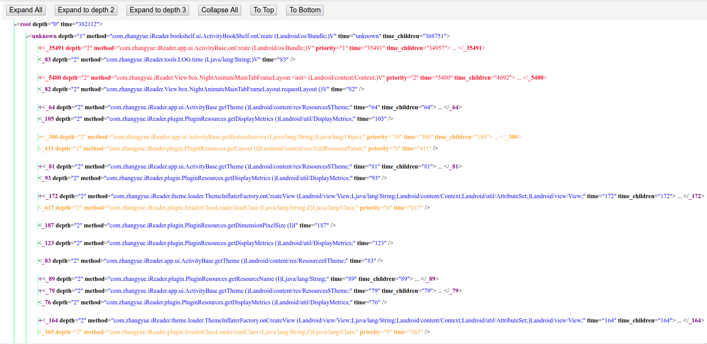

# AndroidTraceDataAnalyzer
### 由来：
- 优化应用的启动速度，需要先找到瓶颈点
- 通过加入计时代码来检测，费时费力，而且无法复用到不同代码上
- 通过method trace来检测，无需改动代码
- Android IDE自带的TraceView或CPU Profiler可以分析trace log，但无法定制分析过程，大量非重点信息掩盖了重点信息
- 本工具通过python脚本分析trace log的原始数据，可以自定义分析过程，包括：
    - 只关注特定的线程
    - 只关注特定包名的方法
    - 将统计结果以XML方式输出，输出信息包括了调用链和每个方法的耗时
    - 更多分类，过滤和排序功能（全定制分析过程）
    
### 准备环境：
- 安装python3.5（项目按照python3.5规范编码)
- 下载该项目并安装各个依赖库: progressbar

### 准备输入文件：
- 准备好trace文件，名字应该是xxxx.trace 

[生成trace文件的方法](https://developer.android.com/studio/profile/generate-trace-logs)

### 运行：
- 运行processor.py来分析trace log, 假设名字是xxx.trace，输出是在同级目录生成的叫xxx.html的html文件
- 该html文件会自动通过浏览器打开
<br>```python3 processor.py(相对或绝对路径) xxx.trace(相对或绝对路径)```

### 运行结果：

- 按钮说明
   - Expand All : 展开所有节点
   - Expand to depth 2 : 展开所有depth<=2的节点，其余收起
   - Expand to depth 3 : 展开所有depth<=3的节点，其余收起
   - Collapse All : 收起除root外的所有节点
   - To Top : 滚动到最顶部
   - To Bottom : 滚动到最底部
- 节点结构说明：
   - 每个节点都是一次方法调用，节点的名字和"time"属性的值一样，都是这次调用的耗时
   - 耗时的单位都是微秒
   - 耗时是<b>inclusive</b>的，即这个方法从进入到退出的总时间，因为脚本默认只统计主线程，所以所有调用都是顺序执行的，每个方法的耗时都包括了子方法的调用耗时
   - 同级的节点，从上到下依次对应于调用时机的先后
   - 不同级的节点，父子节点关系对应于调用－被调用的关系
   - time属性是这次调用的总耗时，time_childen是其调用的所有子方法加起来的总耗时
   - 因为不是所有子方法都是com.zhangyue或com.chaozh包名的，有可能有调用系统包名的方法（即系统API），所以time属性的值大于等于time_children属性的值
- 过滤说明：
   - 脚本默认<b>只统计主线程</b>的方法调用
   - 脚本默认<b>只统计有com.zhangyue和com.chaozh路径</b>的方法
- 排序说明：
   - 有priority属性的节点，是所有这些方法中耗时前10名的方法
   - priority数字越小，说明耗时越长
   - 红色表示该方法在所有方法中耗时前5名
   - 橙色表示该方法在所有方法中耗时6-10名

